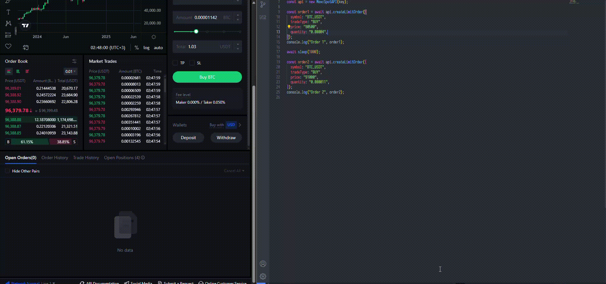

# MEXC Spot API for unlisted tickers (Bypassed)

## Overview
The bypass allows placing orders through API **for symbols that are not available with the standard spot api**. For example, `BROCCOLI_USDT`

*Code is currently only available in Typescript and C#. Other languages available upon request.*

### To get access or if you have any questions, contact at:

* Telegram: [@vecful](https://t.me/vecful) (I am usually on here)
* Discord: @vecful

If you are interested in futures api bypass, you can find more info here: [mexc-futures-api](https://github.com/vecful/mexc-futures-api) 

## Methods available

* createLimitOrder
* createMarketOrder
* createOcoOrder
* createTriggerOrder
